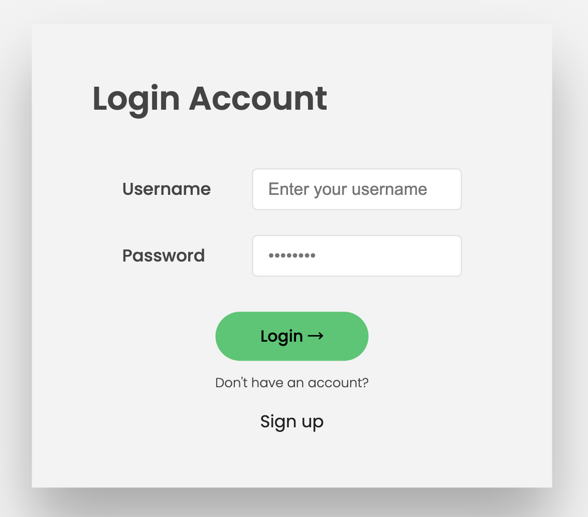
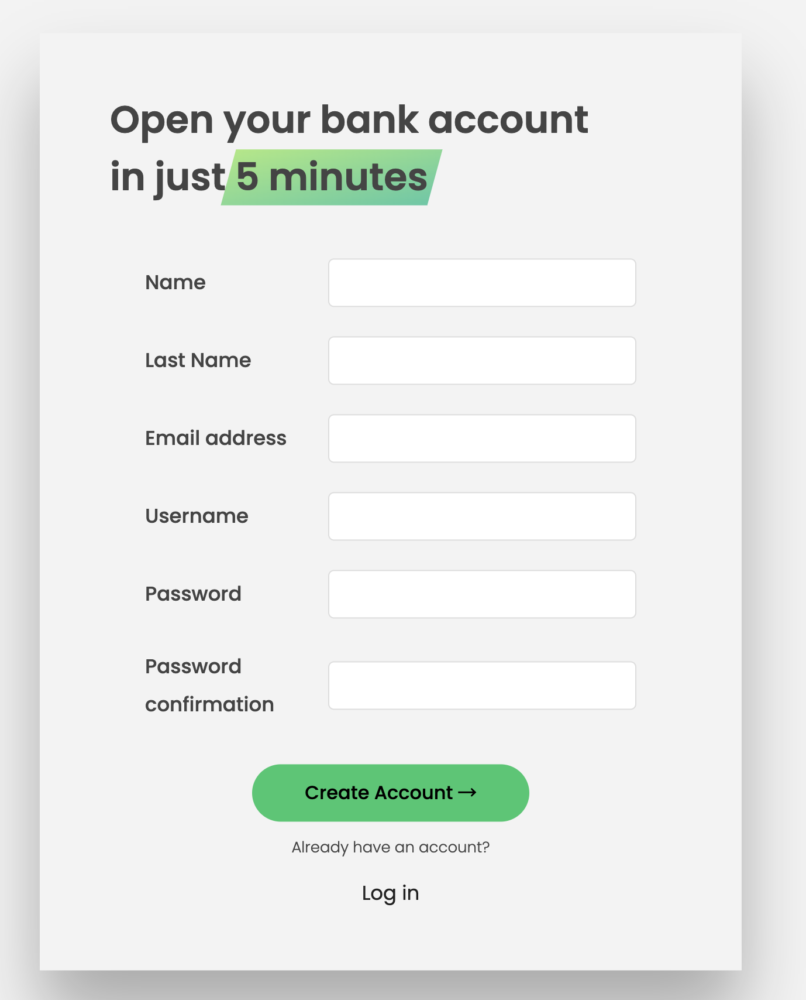
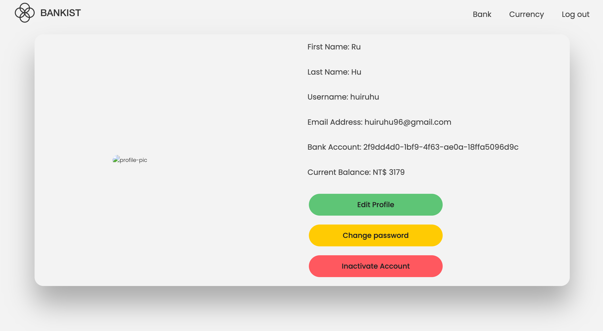
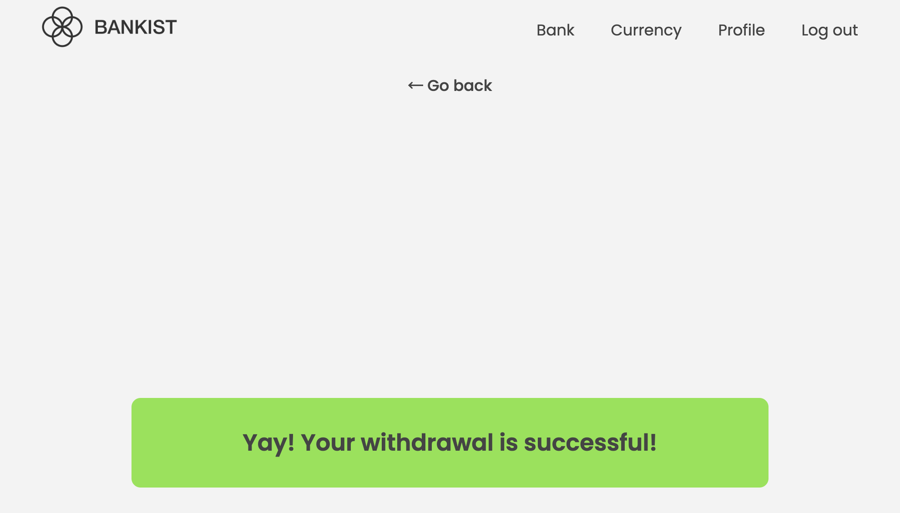
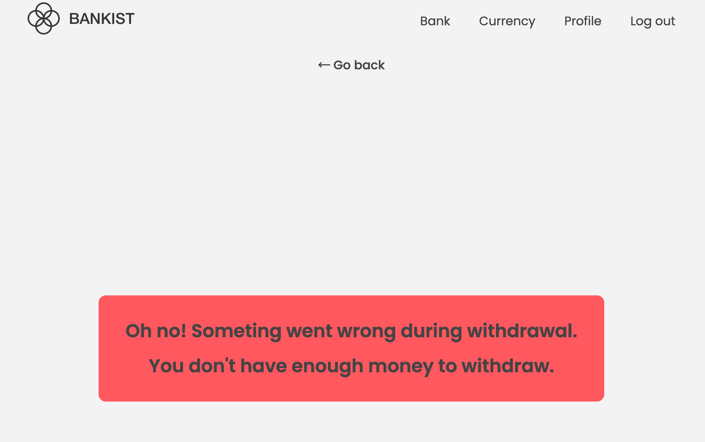

# Bankist 虛擬網路銀行

- [Bankist 虛擬網路銀行](#bankist-虛擬網路銀行)
  - [我的網站](#我的網站)
    - [所使用的技術](#所使用的技術)
    - [專案介紹](#專案介紹)
    - [動機及project設計](#動機及project設計)
    - [專案重點](#專案重點)

## 我的網站

<https://finance-django-production.up.railway.app/>

### 所使用的技術

    1. HTML
    2. CSS
    3. JavaScript
    4. Python
    5. Django
    6. ExchangeRate API
    7. Railway(Deployment)

### 專案介紹

    這是一個由Python、Django以及JavaScript為邏輯所寫成虛擬銀行網站，不僅有提款、領錢、貸款的功能，也有外幣買賣、查詢歷史買賣、查詢現價的功能

### 動機及project設計

    這個專案的起源是在上Udemey平台上的Jonas Schmedtmann 所開設的JavaScript課程，當初在練習JavaScript Array 以及DOM manipulation時，我便想把這個練習變得更加全面，因而就有了這個project的產生。

    在project的設計上，主要有三個面向：一般的banking功能、外幣的買賣功能及使用者驗證的功能。banking前端是老師在上課時為我們設計的，我則寫了能支援其功能的Django後端，而外幣兌換與使用者介面的前端及後端皆由我設計及編寫，外幣的資料來源來自ExchangeRate API。

### 專案重點

1. 使用者頁面

   

   

   

2. 銀行頁面

   

   

   

3. 外幣頁面

    

    

    
